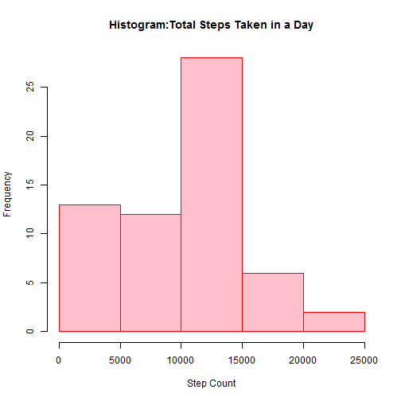
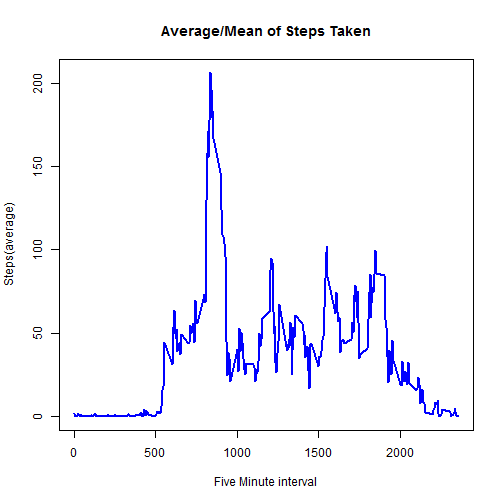
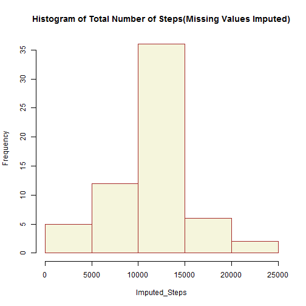
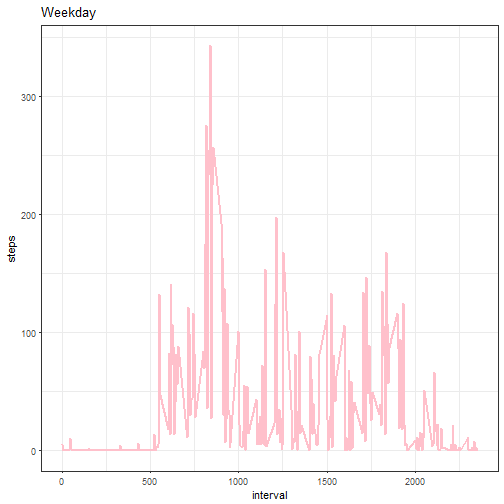
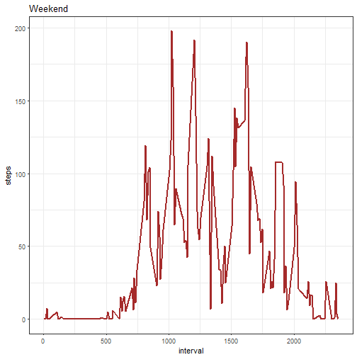

library(ggplot2)
library(knitr) 
library(markdown)
library(Hmisc)
library(lubridate)


# (1) Total Steps Taken in a Day

```r
datac<-read.csv("./Course5/activity.csv") 
str(datac)
```

```
## 'data.frame':	17568 obs. of  3 variables:
##  $ steps   : int  NA NA NA NA NA NA NA NA NA NA ...
##  $ date    : Factor w/ 61 levels "2012-10-01","2012-10-02",..: 1 1 1 1 1 1 1 1 1 1 ...
##  $ interval: int  0 5 10 15 20 25 30 35 40 45 ...
```

```r
names(datac)
```

```
## [1] "steps"    "date"     "interval"
```

```r
steps <- aggregate(datac$steps, by = list(datac$date), sum, na.rm=TRUE) 
hist(steps[,2],main="Histogram:Total Steps Taken in a Day",col="pink", border="red",xlab="Step Count")
```




# (2) Calculate Mean and Median of the Total Number of Steps Taken Daily

```r
steps_mean <- mean(steps[,2]) 
steps_median <- median(steps[,2])
print(steps_mean)
```

```
## [1] 9354.23
```

```r
print(steps_median)
```

```
## [1] 10395
```

# (3) Average Daily Pattern of Activity

```r
stepavg <- aggregate(steps ~ interval, data = datac, mean, na.rm = TRUE)

plot(stepavg$interval, stepavg$steps, type = "l", lwd = 2.5, col = "blue",
     main = "Average/Mean of Steps Taken", xlab = "Five Minute interval", ylab = "Steps(average)")
```




# (4) Inputting Missing Values
## This task is achieved by the 'Hmisc' package function called impute which fills in the missing values with arbitrary constants: You can search to fetch the help contents '?impute'

```r
library(Hmisc)
missingval <- length(which(is.na(datac$steps)))
imputed <- datac
imputed$steps <- impute(datac$steps, fun=mean)
imputedstepsd <- tapply(imputed$steps, imputed$date, sum)
hist(imputedstepsd,main="Histogram of Total Number of Steps(Missing Values Imputed)",col="beige",border = "brown",xlab="Imputed_Steps")
```


 

#(5) Weekday and Weekend Steps


```r
library(ggplot2)
ds<-datac$date
dss<-as.Date(ds)
dayz<-weekdays(dss)
datac$dayz<-dayz
dayz<-as.character(dayz)
wkday<-subset(datac,dayz==c("Monday","Tuesday","Wednesday","Thursday","Friday"))
```

```
## Warning in dayz == c("Monday", "Tuesday", "Wednesday", "Thursday",
## "Friday"): longer object length is not a multiple of shorter object length
```

```r
wkend<-subset(datac,dayz==c("Satuday","Sunday"))
par(mfrow=c(1,2))
wkday_sb<-aggregate(steps~interval,wkday,mean,na.rm=TRUE)
wkend_sb<-aggregate(steps~interval,wkend,mean,na.rm=TRUE)  
plot1<- ggplot(wkday_sb, aes(interval, steps))
plot1 + geom_line(color = "pink",size=1)+theme_bw()+ggtitle("Weekday")
```



```r
plot2<- ggplot(wkend_sb, aes(interval, steps))
plot2 + geom_line(color = "brown",size=1)+theme_bw()+ggtitle("Weekend")
```


